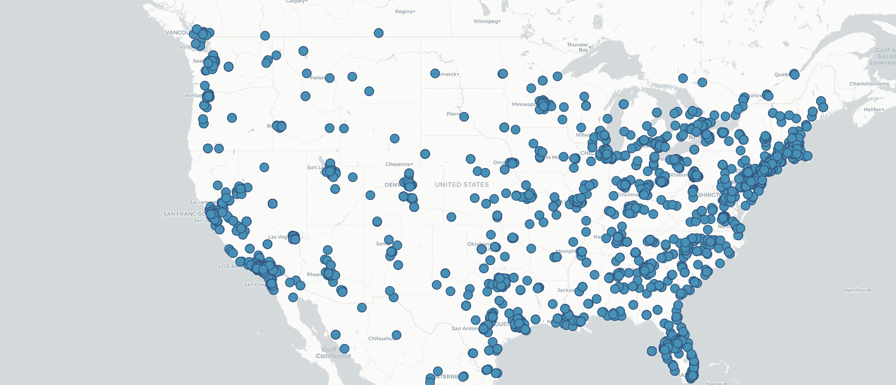
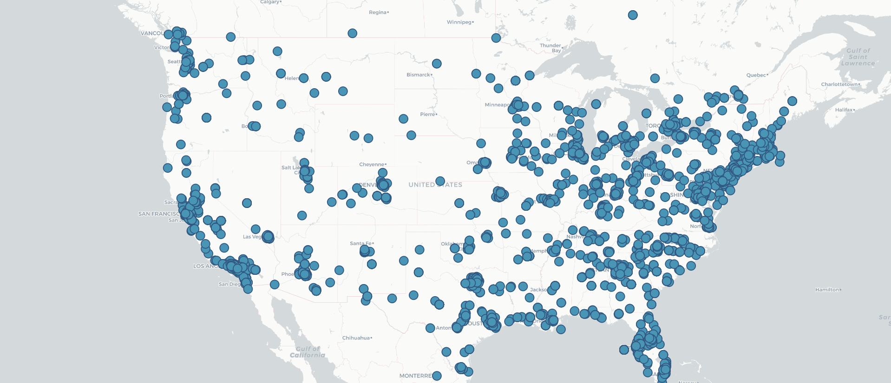
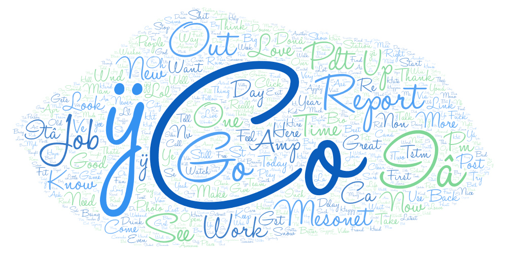
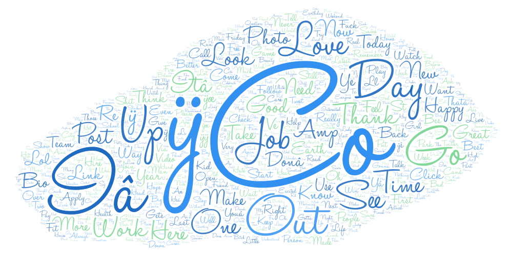

# Comparison

I did a comparison of yesterday and today's tweets about coronavirus. I wanted
to make this comparison because every day it seems there is a new development
with coronavirus. I think it would help get a better sense of how people are
reacting each day to the coronavirus.

# Maps

### Map 1

### Map 2

The geographic distribution of the tweets are similar in both maps. I think it follows the population density of the country. There are a lot of tweets coming out of the west and east coast. The east coast was hit heavily by the coronavirus so it might also have a correlation with the number of tweets coming out of there.

# Word Clouds

### Word Cloud 1

### Word Cloud 2

It seems there were a lot of spam links and bot accounts tweeting things about the coronavirus so this exercise uncovered something worrying. Once we get past that, a couple words stand out to me such as 'Report', 'Job', 'Work', 'Love', 'Time', and 'Out'. It's been about 2 years since the pandemic shut everything down, and these words I think resonate with that. People have lost jobs and want to go back to work, they have lost loved ones to the coronavirus, and for the longest time, people just wanted to go out and be among others. With all the links encountered, I think there is also a misinformation campaign to try to mislead people about the coronavirus.
